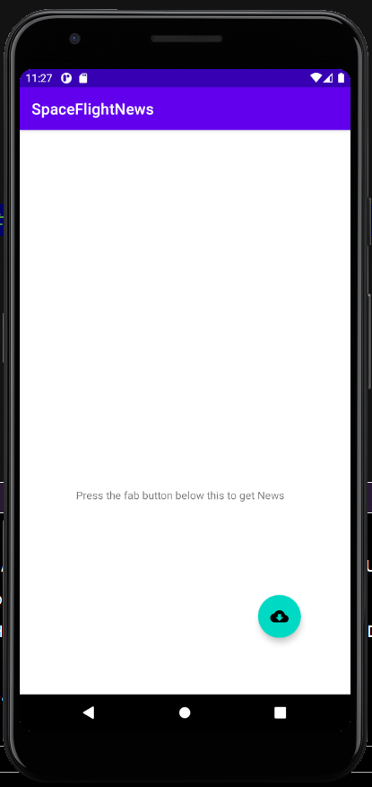
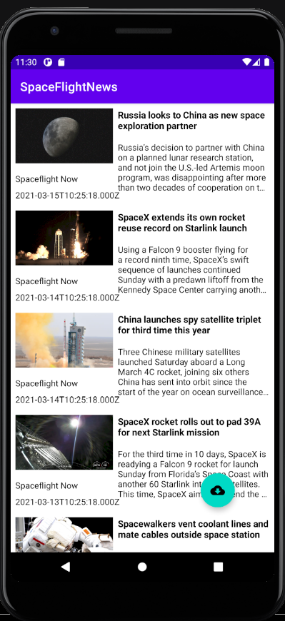

# spaceFlightNews   

 ## Discription 
 -------------------------------------------------------
- This is a News app which display the latest space related news
- I used MVVM design pattern and  concepts of Clean architecture
- I have considered separation of concerns and the testability that each layer provides.
- I have implemeted an entity mapper for mapping the data between the network entity and the domain model which makes our network model replacable. 
- Dagger hilt for dependecy injection 
- I have Resource wrapper class for managing the request status and a responseHandler class for handling success and diffrent kind of IO exeptions  
- Since the idea of the project is to retrive and display latest news,I did not implement a local cash , but I have other projects in this 
 GitHub page in case needs to check my local cash implementation. 
- Junit 4  for unit test 

---

 ## Technologies / Techniques 
    
 -----------------------------------------------------
 
- Native android
- Retrofit
- Coroutines and LiveData
- Glide 
- Dagger Hilt 
- view binding
- Junit 4 /unit test

 
 |  Min SDK Version | Version Name  | SDK Version |
 | ---------------- |:-------------:| ----------  |
 |  27              |  1.0          |      30    |

 
 

---------------------------------------------------------

## Design pattern /architecture

- Model View ViewModel

-----------------------------------------------------------

## Instractions

- To run and test the app , it is possible to clone this repository. I have also attached the zip file on my last email 
- I preffred the user to retrive the news by pressing the fab buttom rather than auto loading when the app start
- when the app start there is a text which guid the user to press the button to get the news 
- press the fab button and the news will be displayed 

-----------------------------------------------------------
 

## photos

---------------------

.  .  .   . 
